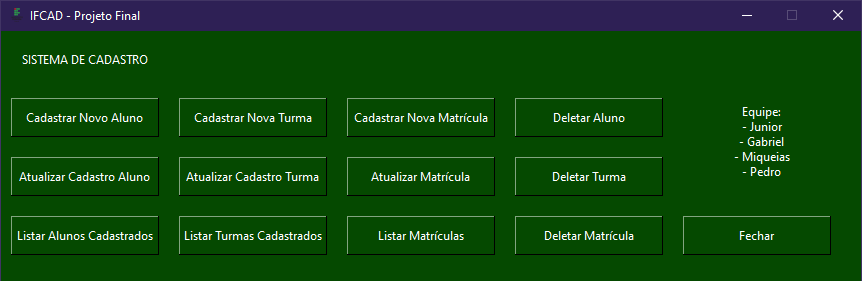

---

 

  

  <h3 align="center">IFCAD - Sistema de Cadastros</h3>

  

    Um sistema de cadastro de alunos, turmas e matrículas.  
    Feito com SQLite3 e GUI Tkinter.
     
    <a href="https://youtu.be/MGslEcmVurg"><strong>Página de Download »</strong></a>
     
     
    <a href="https://raw.githubusercontent.com/iamjunioru/sistema-de-cadastro/main/menu.py">Ver Código</a>
    ·
    <a href="https://github.com/iamjunioru/sistema-de-cadastro/issues">Reportar Bugs</a>
    ·
    <a href="https://github.com/iamjunioru">Perfil</a>
     
     
     
  

---
---

 

  <h2>Interface</h2> 
  
     
    
  
  
---
